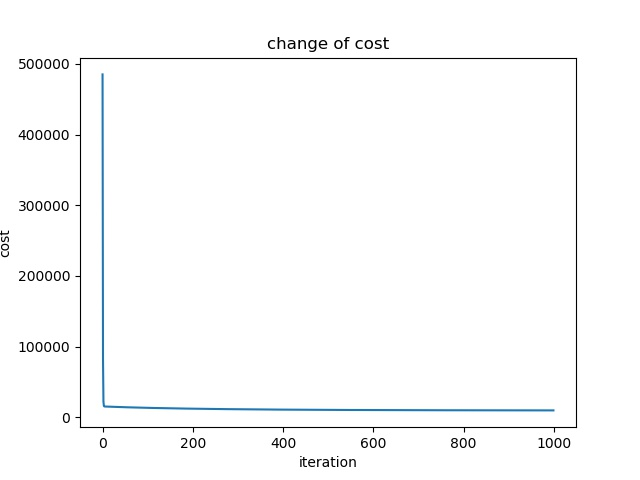
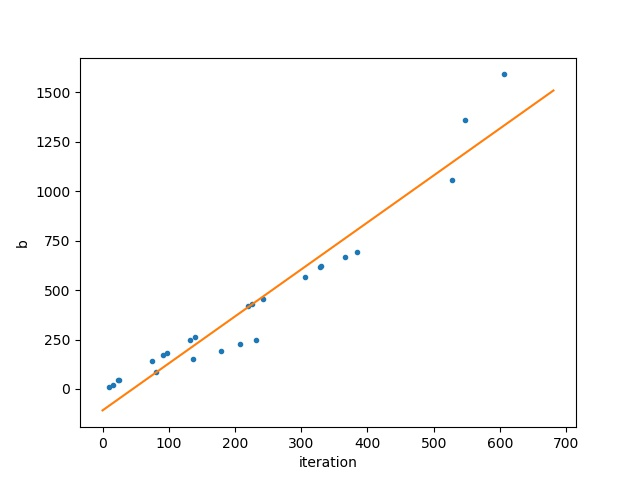
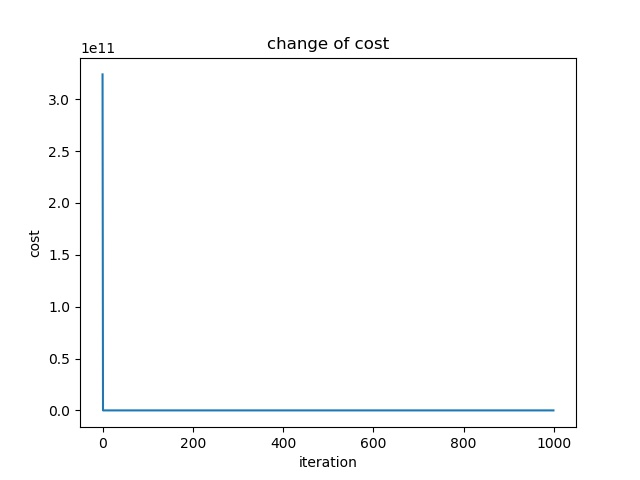
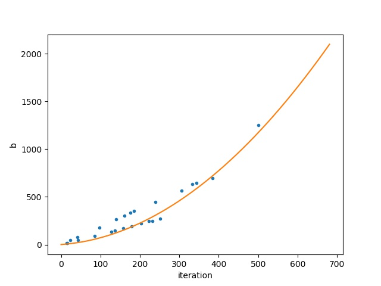
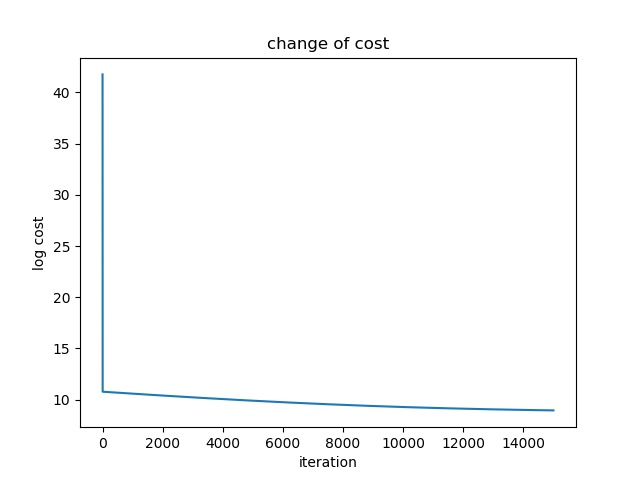
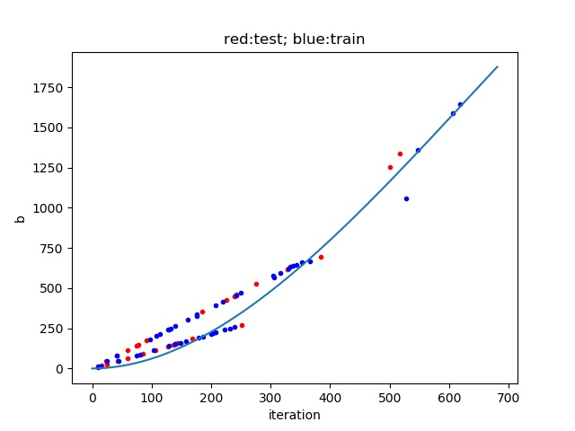
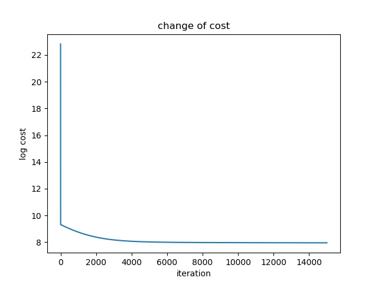

I write these simple codes in this repo in the summer of 2018 to practice Tensorflow. It is inspired by online course of [Hung-yi Lee](<http://speech.ee.ntu.edu.tw/~tlkagk/>) and official Tensorflow [tutorials](<https://www.tensorflow.org/tutorials>).

The data I was studying was some data of Pokémon. Basically I simply attempted to use gradient descent to find the relationship between the origin and new cp value of a Pokémon.

## Linear function

cost change during the training:

Result

## Quadratic function

cost change during the training:

Result

## Cubic function

cost change during the training:

Result (Blue points are training data and red points are testing data)

## Multiple dimensions

Use origin cp, height and weight.

cost change during the training:

